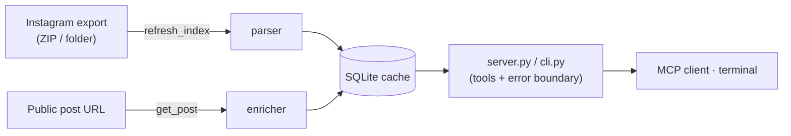

<div align="center">

# instagram-saved-mcp

**Your Instagram Saved posts, available to any AI assistant.**

Read your Instagram data export locally, enrich posts from their public page, and search it all — from [Claude](https://claude.ai), Cursor, Codex, or your terminal. No login, no API keys, no data leaves your machine.

[](https://pypi.org/project/instagram-saved-mcp/)
[](https://pypi.org/project/instagram-saved-mcp/)
[](https://github.com/NAJEMWEHBE/instagram-saved-mcp/actions/workflows/test.yml)
[](LICENSE)
[](https://modelcontextprotocol.io)

</div>

```bash
uvx instagram-saved-mcp          # MCP server (what your AI client launches)
uvx instagram-saved-mcp --help   # or use it straight from the terminal
```

## Contents

- [Why](#why) · [Features](#features) · [Quickstart](#quickstart) · [CLI](#cli) · [Connect an AI client](#connect-an-ai-client) · [How it works](#how-it-works) · [Privacy](#privacy) · [Configuration](#configuration) · [Roadmap](#roadmap) · [Contributing](#contributing)

## Why

Instagram lets you *save* posts but gives you almost no way to use that pile — no search, no export, no API. Meanwhile your "Download your information" export contains every saved URL and collection. This server turns that export into a queryable local library your AI assistant (or your shell) can actually work with.

## Features

| | |
|---|---|
| **Bring your own export** | Reads the official Instagram data export — ZIP or extracted folder. |
| **Collections, intact** | Merges `saved_posts.json` + `saved_collections.json`, labelling each post (or `All Posts`). |
| **On-demand enrichment** | `get_post` pulls caption, author, hashtags, and image from the public page and caches it. |
| **Local search** | Full-text-ish search over enriched captions, hashtags, and authors. |
| **Two front ends** | Same logic as an MCP server *and* a terminal CLI. |
| **Private by design** | No credentials, no uploads. One local SQLite file. |

## Quickstart

**1. Export your data.** Instagram → Settings → *Download your information* → request **Saved**, format **JSON**. Download the ZIP when it arrives (no need to unzip).

**2. Install [uv](https://docs.astral.sh/uv/), then import:**

```bash
uvx instagram-saved-mcp refresh "path/to/instagram-export.zip"
uvx instagram-saved-mcp collections
```

**3. Connect an AI client** (below) — or keep using the CLI.

## CLI

```text
instagram-saved-mcp <command> [options]

  serve                      Run the MCP server over stdio (default if no command)
  refresh <path>             Import an export ZIP or folder
  collections                List collections and post counts
  list [--collection N]      List saved posts, newest first  [--limit N]
  get <url>                  Fetch + cache one post's details
  search <query>             Search enriched posts
                             (--json on any data command for machine output)
```

```console
$ instagram-saved-mcp list --collection Recipes --limit 3
2024-03-09  Recipes              https://www.instagram.com/p/DVQtFLqEoFv/
2024-02-28  Recipes              https://www.instagram.com/p/CzX12abQ9pL/
2024-01-15  Recipes              https://www.instagram.com/reel/Cy88mn0gAbc/
(3 posts)

$ instagram-saved-mcp get https://www.instagram.com/p/DVQtFLqEoFv/
https://www.instagram.com/p/DVQtFLqEoFv/
  author     @chef
  collection Recipes
  hashtags   #pasta #weeknight
  caption    The 10-minute pasta everyone keeps asking about...
```

## Connect an AI client

All clients launch the same command: `uvx instagram-saved-mcp`.

**Claude Desktop** — `%APPDATA%\Claude\claude_desktop_config.json` (Windows) / `~/Library/Application Support/Claude/claude_desktop_config.json` (macOS). Windows users can just run [`installers/install_windows.bat`](installers/install_windows.bat).

```json
{
  "mcpServers": {
    "instagram-saved": { "command": "uvx", "args": ["instagram-saved-mcp"] }
  }
}
```

**Cursor** — `~/.cursor/mcp.json` (same JSON shape as above).

**Codex CLI** — `~/.codex/config.toml`:

```toml
[mcp_servers.instagram-saved]
command = "uvx"
args = ["instagram-saved-mcp"]
```

Restart the client, then ask it to `refresh_index` with your export path and explore.

### Tools exposed to the client

| Tool | Description |
|------|-------------|
| `list_collections()` | Collections and their post counts. |
| `list_saved(collection?, limit?)` | Saved posts, newest first. |
| `get_post(url)` | Caption, author, hashtags, image — cached after first fetch. |
| `search_saved(query)` | Search enriched posts. |
| `refresh_index(zip_path)` | Import / re-import an export. |
| `transcribe_post(url)` | Reel transcription — **v0.2 stub** (downloads nothing yet). |

## How it works



Layers stay isolated: `parser` is pure (no network, no DB), `enricher` only touches the network, `cache` only touches SQLite. `server.py` and `cli.py` orchestrate them and are the single place that turns typed errors into clean messages — a stack trace never reaches the client.

## Privacy

- **Read-only of your own data** — the export *you* download.
- **No credentials, ever.** `get_post` fetches only *public* pages, anonymously, best-effort. When Instagram serves a login wall you get a clean message, not a crash.
- **Local only** — one SQLite file (`~/.instagram-saved-mcp/cache.db` by default).

## Configuration

| Environment variable | Purpose | Default |
|----------------------|---------|---------|
| `INSTAGRAM_SAVED_MCP_DB` | SQLite cache location. | `~/.instagram-saved-mcp/cache.db` |
| `INSTAGRAM_SAVED_EXPORT` | Auto-import this export on startup if the DB is empty. | unset |

## Roadmap

- **v0.2** — `transcribe_post`: download a reel with `yt-dlp` and transcribe with `faster-whisper` (GPU with CPU fallback). Ships as an opt-in extra: `uvx instagram-saved-mcp[transcribe]`.

## Contributing

PRs welcome — see [CONTRIBUTING.md](CONTRIBUTING.md). Tests run offline: `uv run pytest`. Changes are tracked in [CHANGELOG.md](CHANGELOG.md).

## License

[MIT](LICENSE)
